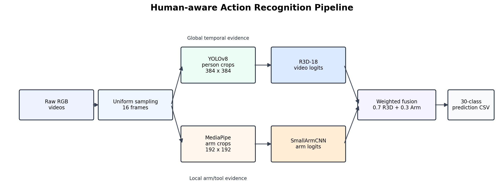
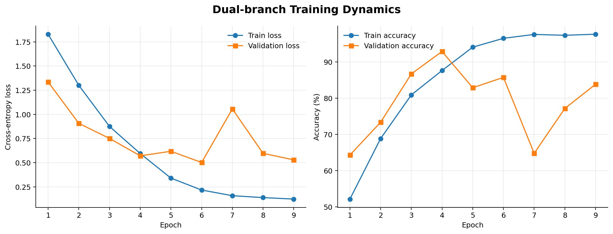
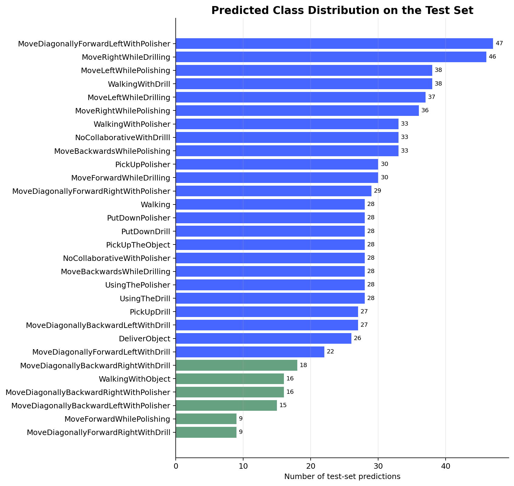
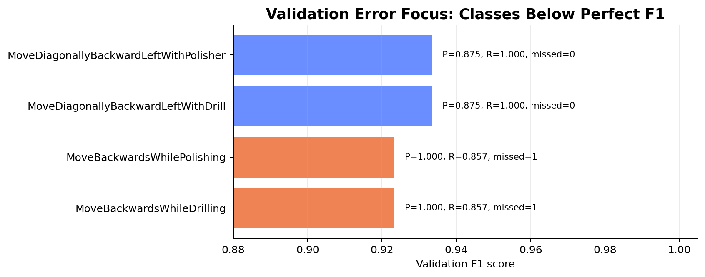

# Human-aware Action Recognition for Collaborative Robots

[](https://github.com/jxh0917-arch/Sensing-and-Perception/actions/workflows/ci.yml)


This repository contains a reproducible perception workflow for recognising human activities in manufacturing videos. It was developed for the 7CCEMSAP Sensing and Perception final project, where the system is assessed on reproducibility, originality, and justification.

The project targets the HRI30 industrial human-robot interaction setting. The method combines whole-body temporal cues with local arm-motion evidence:

- **R3D-18 video branch**: learns spatiotemporal action features from 16 uniformly sampled person-centred frames.
- **SmallArmCNN branch**: learns local arm-pose cues from MediaPipe-derived arm crops.
- **Late weighted fusion**: combines global and local evidence using `0.7 * R3D + 0.3 * ArmCNN`.
- **Submission workflow**: produces `test_set_labels.csv` in the required `video_id,class_name,class_id` format.

## Key Contributions

- A task-informed dual-branch architecture for industrial human action recognition.
- A reproducible preprocessing workflow combining YOLOv8 person crops and MediaPipe-guided arm crops.
- Public documentation for setup, data boundaries, model behaviour, experiment tracking, and error analysis.
- A lightweight CI workflow that checks repository structure and Python syntax.

## Why This Design

Industrial actions can be visually similar at the whole-body level, especially when direction, tool use, and manipulation subtleties overlap. The R3D-18 branch provides strong temporal recognition, while the arm branch adds fine-grained local evidence for tool handling and hand-dominant actions. This is an incremental but meaningful extension beyond an off-the-shelf video classifier because it introduces task-specific human-object interaction cues.

## Repository Layout

```text
.
|-- HELLOWORLD/
|   |-- annotations/                 # class map and train/val/test CSV files
|   |-- config.py                    # central experiment configuration
|   |-- dual_model.py                # R3D-18 + SmallArmCNN fusion model
|   |-- preprocessed_dataset.py      # dataset and collate logic for extracted crops
|   |-- preprocess_videos.py         # training video preprocessing
|   |-- preprocess_test_video.py     # test video preprocessing
|   |-- train_dual.py                # training entry point
|   |-- validate.py                  # validation and metrics
|   |-- testing_set_application.py   # final test-set prediction export
|   |-- results/                     # tracked CSV/report outputs
|   `-- requirements.txt             # CUDA-oriented dependencies
|-- docs/
|   |-- environment.md              # dependency and upload policy
|   |-- data_card.md                # dataset scope and public/private boundary
|   |-- project_brief.md             # coursework objectives and deliverables
|   |-- methodology.md               # model rationale and limitations
|   |-- literature_context.md        # related work and design context
|   |-- reproducibility.md           # end-to-end reproduction guide
|   |-- results.md                   # reported metrics and interpretation
|   |-- project_notes.md             # concise project discussion notes
|   `-- artifact_manifest.md         # public/local artifact split
|-- environment.yml                  # optional Conda environment specification
|-- run_pipeline.py                  # workflow runner from repository root
|-- scripts/run_pipeline.ps1         # PowerShell wrapper for Windows
|-- tools/
|   `-- validate_repository.py       # lightweight repository sanity checks
`-- .github/workflows/ci.yml         # static CI checks
```

Large data, checkpoints, preprocessed frames, and local Python runtimes are intentionally ignored by Git. This keeps the GitHub repository reviewable while preserving a complete local workflow.

## Quick Start

From the repository root:

```bash
python -m pip install -r HELLOWORLD/requirements.txt
```

Place the supplied datasets in:

```text
HELLOWORLD/training_set/
HELLOWORLD/test_set/
```

Then run the full workflow:

```bash
cd HELLOWORLD
python preprocess_videos.py
python split_dataset.py
python train_dual.py
python validate.py
python preprocess_test_video.py
python testing_set_application.py
```

Alternatively, run common workflow targets from the repository root:

```bash
python run_pipeline.py check
python run_pipeline.py submission
```

The final submission file is written to:

```text
HELLOWORLD/results/test_set_labels.csv
```

## Project Showcase

### Pipeline



The system combines a global temporal branch and a local arm branch. R3D-18 models whole-body motion from 16 sampled person crops, while SmallArmCNN models arm/tool cues from MediaPipe-derived crops. The final prediction uses weighted late fusion.

### Training Evidence



The training history shows fast convergence and a strong validation trajectory across the recorded epochs.

### Test-set Prediction Distribution



The exported test prediction file is:

```text
HELLOWORLD/results/test_set_labels.csv
```

It follows the required coursework format:

```text
video_id,class_name,class_id
```

### Validation Error Focus



The few non-perfect validation classes are concentrated around backward and diagonal-backward motions, which are visually close in both body trajectory and tool context.

## Current Result Snapshot

The included validation report records:

- Overall accuracy: **99.05%**
- Macro F1 score: **0.9904**
- Micro F1 score: **0.9905**

These results are from the internal validation split and should be interpreted as evidence for the development workflow, not as a substitute for the hidden test-set leaderboard.

## Reproducibility Notes

- Main configuration lives in `HELLOWORLD/config.py`.
- Random seed is set to `42`.
- Training uses 16 frames per video and person crops of `384 x 384`.
- Arm crops use `192 x 192` images from first and last sampled frames.
- Checkpoints are not tracked because they are large; store trained weights externally or attach them to a GitHub Release if required.

See [docs/reproducibility.md](docs/reproducibility.md) for the complete procedure.
See [docs/environment.md](docs/environment.md) for the dependency files and upload policy.
See [docs/data_card.md](docs/data_card.md) for dataset scope and public/private boundaries.
See [docs/literature_context.md](docs/literature_context.md) for related work and method context.
See [docs/model_card.md](docs/model_card.md) for intended use, inputs, outputs, and limitations.
See [docs/experiment_log.md](docs/experiment_log.md) for the completed experiment and planned ablation protocol.
See [docs/error_analysis.md](docs/error_analysis.md) for the validation error focus.
See [docs/artifact_manifest.md](docs/artifact_manifest.md) for the public/local artifact split and large-file rationale.

## Project Positioning

This work is best presented as a task-informed fusion pipeline for human-aware collaborative robotics. Its value is not only the high validation score, but the explicit decomposition of action recognition into global temporal motion and local arm/tool interaction evidence. That decomposition gives a clear research argument for why the model should generalise better than a single black-box baseline in manufacturing settings.
